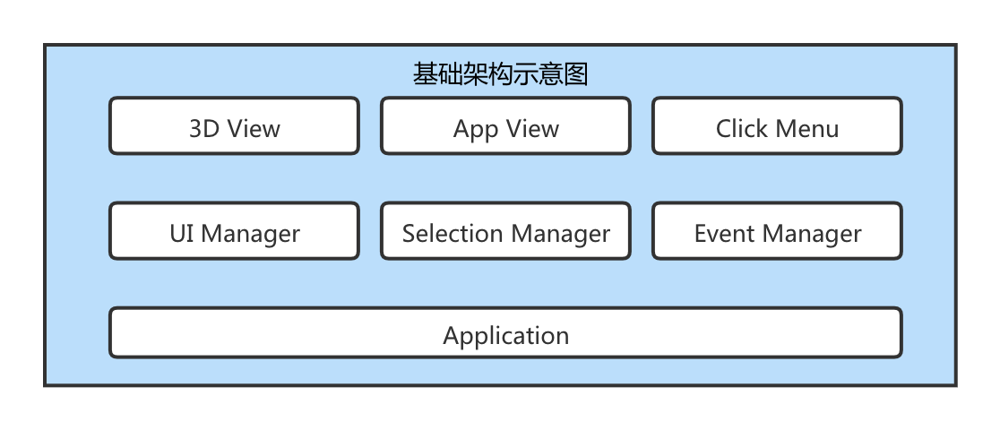

# 前端图形入门 - 在WebGL中实现3D物体的选中和操作

## 介绍
在WebGL中，对物体进行pick选中，并对选中的物体做移动、旋转、缩放操作

---
## 效果预览地址
- [3D物体选中和操作效果](https://jaliy.github.io/j3d-pick/)

## 基础架构示意图

---
## 相关文档

- [ThreeJS官网](https://threejs.org/)

- [WebGL文档](https://www.khronos.org/webgl/)

- [OpenGL](https://www.khronos.org/opengl/)